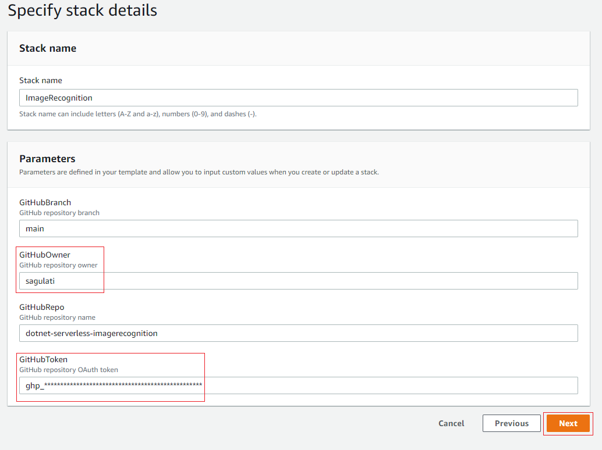
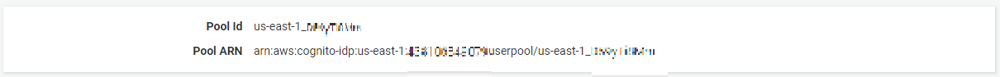
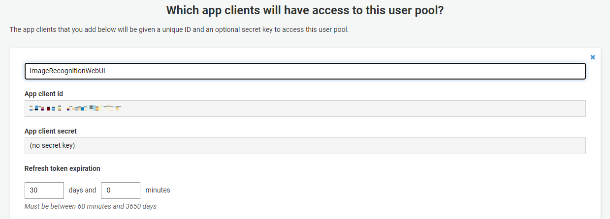
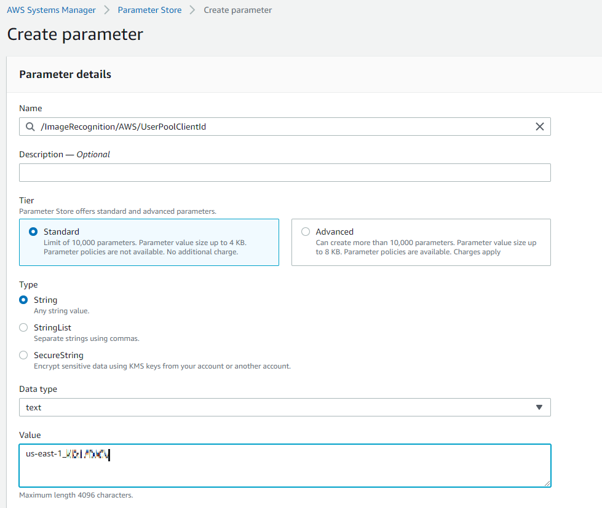

## Serverless Reference Architecture: Building End-to-End .NET Serverless Applications on AWS
The Image Recognition application illustrates modern, serverless, .NET application on AWS. It uses AWS SDK for .NET to work with AWS services from within application code, as well as tools from AWS to integrate with Visual Studio (on Windows) and the dotnet CLI (on Windows, macOS, and Linux) to make working with serverless application development on AWS easy and convenient.

Image recognition is an application that enables registered and signed-in users to upload and organize photos in Albums. After the  photo is submitted, the backend workflow processes photos and extracts metadata from the image such as geolocation, size/format, time, etc. It then uses image recognition to tag objects in the photo. In parallel, it also produces a thumbnail of the photo.

The Image Recognition sample application demonstrates:
* Building ASP.NET Web API project using JWT tokens vended by Cognito to handle authentication. The project is hosted in AWS Lambda using Lambda Container support and the AWS .NET tooling that simplifies using .NET5 Container with Lambda.
* Building frontend using ASP.NET new server-side Blazor web framework hosted in ECS using AWS Fargate.
* Using API Gateway's WebSocket support to build realtime two-way communication application. This project connect backend components to the frontend allowing backend systems to easily communicate their status to the user in real time.
* Using AWS Step Functions to orchestrate a serverless processing workflow built in .NET. This project orchestrate backend using AWS Lambda, Amazon S3, Amazon DynamoDB and Amazon Rekognition.

This repository contains sample code for all the Lambda functions depicted in the diagram below as well as an AWS CloudFormation template for creating the functions and related resources. There is also a test web app that you can run to interact with the backend.

Following the instructions in this sample you will gain experience in deploying to and using the following AWS services, with the tools you are already familiar with - namely Visual Studio and AWS extensions for the dotnet CLI:

* Amazon Cognito
* Amazon DynamoDB
* Amazon ECS
* AWS Fargate
* AWS Lambda
* AWS Step Functions
* AWS Systems Manager

# Walkthrough of the architecture
1. An image is uploaded to the PhotoRepo S3 bucket under the private/{userid}/uploads prefix
1. The S3 upload event triggers the S3Trigger Lambda function, which kicks off an execution of the ImageProcStateMachine in AWS Step Functions, passing in the S3 bucket and object key as input parameters.
1. The ImageProcStateMachine has the following sub-steps:
1. Read the file from S3 and extract image metadata (format, EXIF data, size, etc.)
1. Based on output from previous step, validate if the file uploaded is a supported file format (png or jpg). If not, throw NotSupportedImageType error and end execution.
1. Store the extracted metadata in the ImageMetadata DynamoDB table
1. In parallel, kick off two processes simultaneously:
1. Call Amazon Rekognition to detect objects in the image file. If detected, store the tags in the ImageMetadata DynamoDB table
1. Generate a thumbnail and store it under the private/{userid}/resized prefix in the PhotoRepo S3 bucket

# How to deploy
Follow these instructions to deploy the application (both backend and frontend):
1. Fork this repository in your GitHub account.
2. Click Launch Stack to launch the template in your account and then click Next.
   
    

1. In the parameters section 
   1. Add Stack name as "ImageRecognition".
   2. Change the GitHubOwner to your account.
   3. Grant AWS CodePipeline access to your GitHub repository. 
      1. Create [personal access token](https://docs.github.com/en/github/authenticating-to-github/keeping-your-account-and-data-secure/creating-a-personal-access-token) to use in place of a password.
      2. Add GitHub repository OAuth token parameter to GitHubToken

    

2. Click Next and Next.
    > In the last page of the wizard, make sure to click the checkboxes to accept:
    > 
    > * I acknowledge that AWS CloudFormation might create IAM resources.
    > * I acknowledge that AWS CloudFormation might create IAM resources with custom names.
    > * I acknowledge that AWS CloudFormation might require the following capability: `CAPABILITY_AUTO_EXPAND`
    > 
    > before clicking **"Create stack"**

## Setup the Amazon Cognito User Pool

While the stack is being created, setup a new Amazon Cognito User Pool. This user pool will be used to users to register and login to the sample application when it is deployed. Create the user pool by following the instructions below.

1. Navigate to the console home page in the [AWS Management Console](https://console.aws.amazon.com/)
    * Select *Services* and enter the text **Cognito** into the search bar.
    * Click the resulting entry that is returned.
1. Click **Manage User Pools**
1. Click **Create a user pool**
1. Give the pool a name, then click **Review defaults**
1. Click **Add app client...**
1. Enter a name for the client (for example *ImageRecognitionWebUI*), leave the rest of the settings at their default values and then click **Create app client**.
1. Click **Return to pool details**.
1. Click **Create pool**.
1. After the pool has been created make a note of the following values:
    * From the *General Settings* page:
        * **User Pool id**

        

    * From the App Clients page (click *App clients* in left-hand navigation pane to view this page):
        * **App client id**
        * **App client secret** (click *Show Details* to view)

        

## Record the user pool details in Systems Manager's Parameter Store

The web front-end for the application will retrieve the details of the user pool for user management at run time, by making calls to [Systems Manager's Parameter Store](https://aws.amazon.com/systems-manager/features/#Parameter_Store). Parameter Store is a simple key-value store that can be used to store both plain text and secure string values. In this section you will create three parameters to hold the data identifying the user pool for the application to use.

1. Navigate to the Systems Manager dashboard in the [AWS Management Console](https://console.aws.amazon.com/)
    * Select *Services* and enter the text **Systems** into the search field.
    * Select *Systems Manager* from the results.
1. From the Systems Manager dashboard, scroll through the options on the left navigation panel and select *Parameter Store*.
1. Create three parameters, one by one, for the user pool values you made a note of above, as follows:

    * From the Parameter Store home, click **Create parameter**
    * For the parameter name, enter **/ImageRecognition/AWS/UserPoolId**
    * Set the parameter type to be *String*
    * For the parameter value, enter the value you recorded for *User pool id* above, then click **Create parameter** to finish. For example:

        

    * Repeat the process to create a second parameter. This time set the parameter name to be **/ImageRecognition/AWS/UserPoolClientId**, the parameter type to be *String* and the value should be set to the *App client id* value you recorded above.
    * Repeat the process a final time to create the third parameter. For parameter name, enter **/ImageRecognition/AWS/UserPoolClientSecret**. For the parameter type, select *SecureString*. Leave the *KMS key source* and *KMS Key ID* fields at their defaults. In the Value field, enter the value of the *App client secret* you recorded earlier.

# Using the test web app
### Sign up and log in
1. Go to the URL of the deployed app.

1. In the login page, click on "Create account"
   
2. Register an account by following the sign up instructions
   
   

3. After confirming the account, sign in

### Album List
1. create albums using the "Add a new album"
   

### Photo gallery
1. Click into an album you created
1. Upload a photo
2. You can follow the Step Functions execution link to review the details of the workflow execution Below is the diagram of the state machine being executed every time a new image is uploaded (you can explore this in the Step Functions Console):
   
   
3. When the processing finishes, the photo and extracted information is added to the display
   
   

# Cleaning Up the Application Resources
To remove all resources created by this example, do the following:

Go to AWS CloudFormation console, delete the stacks with name "Image-Recognition-"

## Security

See [CONTRIBUTING](CONTRIBUTING.md#security-issue-notifications) for more information.

## License

This library is licensed under the MIT-0 License. See the LICENSE file.